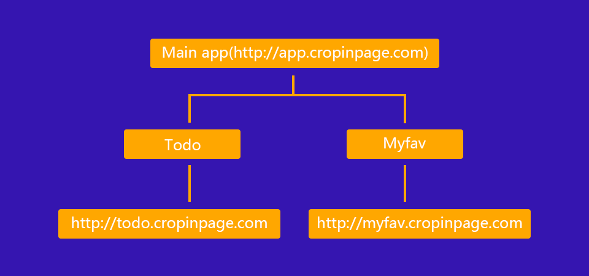

# micro_frontend
微前端示例代码

## 应用

* MainApp: [http://app.cropinpage.com](http://app.cropinpage.com)
    * Subapp(todo): [http://app.cropinpage.com/todo](http://app.cropinpage.com/todo)
    * Subapp(myfav): [http://app.cropinpage.com/myfav](http://app.cropinpage.com/myfav)
* Todo: [http://todo.cropinpage.com](http://todo.cropinpage.com)
* Myfav: [http://myfav.cropinpage.com](http://myfav.cropinpage.com)

## 结构

